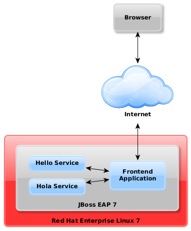
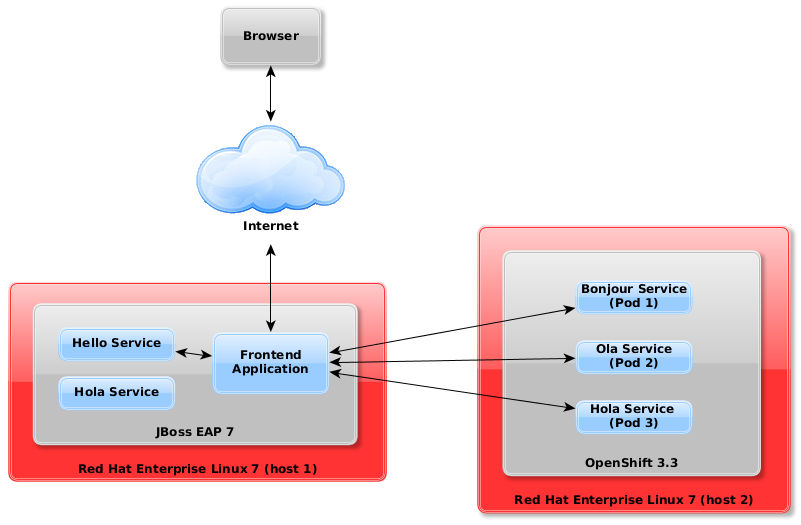

# PlusOne Demo
***

## Purpose

The purpose of this is to demonstrate the introduction of an OpenShift containerized implementation into an existing legacy infrastructure.  

The legacy application used in this demo is a simple web application packaged as a war having a front end calling restful webservices to display various 'hello world' messages.



We first introduce new services running in OpenShift and integrate them in to the existing legacy application.


The final example is to move one of the legacy services to OpenShift and modify the front end application to use the new service.



## Prerequisites
- **Linux**
	- This demo was created and tested using Fedora 24 and RHEL 7.3.
- **Java Runtime**
	- version >= 1.8
- **Docker**
	- version >= 10 <https://docs.docker.com/engine/installation/>
	- add the following to /etc/sysconfig/docker
```sh
INSECURE_REGISTRY='--insecure-registry 172.30.0.0/16'
```
- **Ansible**
	- version >= 2.3
	*At time of writing (2016/11/28), some Linux distro's had version 2.2 in their repositories and in order to get 2.3 you have to run from source* <http://docs.ansible.com/ansible/intro_installation.html#running-from-source>.
	- The host running ansible must be able to remotely connect to both the server running a standalone 'legacy' web application in wildfly and the server that will be running OpenShift.  Please read the following for more information <http://docs.ansible.com/ansible/intro_getting_started.html#id5>
- **Git**
	- version >= 2.7

## Download the Demo
Clone the github repository
	
	$ git clone https://github.com/rduncan506/plusone.git
	
## Option 1 - From Binaries
To make it easier and remove dependencies on build tools, all source has been compiled/packaged and has been downloaded when cloning the github repository in the previous step.

### Step 1 - Configure Installation
Edit <plusoneROOT\>/ansible/plusonedemo/hosts

Edit <plusoneROOT\>/ansible/plusonedemo/site.yaml

### Step 2 - Run Ansible to Install the Legacy Application
	$ cd <plusoneROOT\>/ansible/plusonedemo
	$ ansible-playbook -i hosts legacy.yml

### Step 3 - Run Ansible to Install OpenShift Services
	$ cd <plusoneROOT\>/ansible/plusonedemo
	$ ansible-playbook -i hosts openshift.yml

## Option 2 - From Source
###Additional Prerequisites
In addition to the main prerequisites above, the following are required to compile and deploy the source in the following sections.

- **Maven**
	- version >= 3.3
- **NPM**
	- version >= 2.15

### Step 1 - Build and Deploy Legacy Application
With Wildfly or JBoss running, execute the following

	$ cd <plusoneROOT\>/plusonelegacy
	$ mvn clean install wildfly:deploy


## Troubleshooting


## Notes
	$ kill -9 `fuser -f nohup.out`
	$ docker stop origin `docker ps -q`
